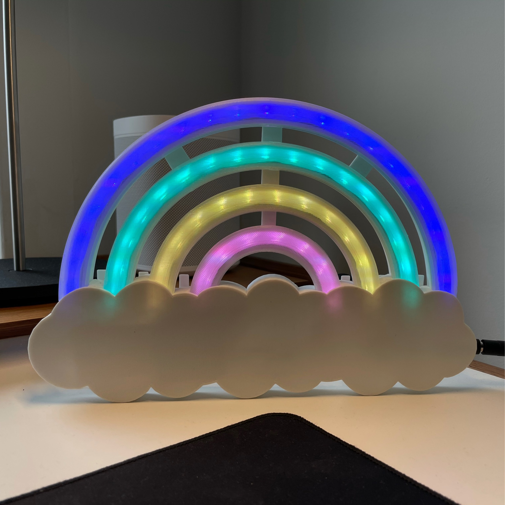

LED Rainbow
-----------

Fully 3D printed LED rainbow clock. Designed for my daughter both as a room decoration and a wake-up and go to sleep time reminder. Cycles through pre-configured colours, slowly dims when it's sleep time and slowly turns on when it's time to wake up.

Other than the 3D printed pieces, used parts are:

- Arduino Nano (or similar)
- Real-Time Clock unit DS3231
- Buck voltage converter
- Female DC power jack
- 12V power adapter (can go higher or lower, uses about 2A at full brightness)
- WS2812 addressable LEDs (57 LEDs used)

Implementation is daylight-savings aware, you can turn this off if you like.

